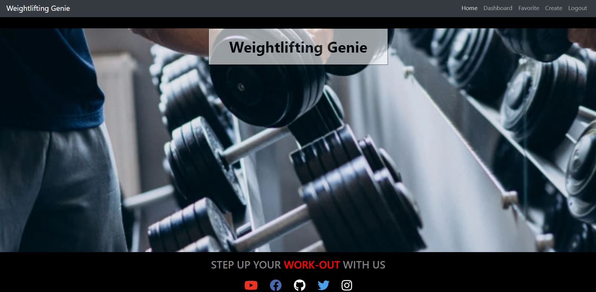

# Project_3 Weighlifting Genie

- [Description](Description:)
- [Technologies Used](#Technologies)
- [Screenshots of Deployed Application](#screenshots-of-deployed-application)
- [Link to Deployed Application](#link-to-deployed-application)
- [The Team](#the-team)
- [For the Future](#for-the-future)

## Description:

Weightlifting Genie is full CRUD application created to simplify your fitness journey. 
As a Weightlifting Genie app user, you will be able to create, generate, and add workouts. 
Whether you work out at home, the gym, or outside, the app is designed to make it easy for you to keep up with your fitness. All you need are weights!

Included features of Weightlifting Genie Application
Personalization: When signing up, users will  have access to their own dashboards, where they’re able to save their favorite workouts
Full Body Workout: Some provided workouts include arms, legs, back, & shoulders
Customizability: You have the ability to create your own workouts 
Tracking Functionality: Users can keep track of their reps, sets, weight, and time per workout 

## Technologies

- React
- Node
- Express
- MongoDB & Mongoose ORM
- GRAPHQL
- Apollo Server
- CSS
- JSX
- JavaScript
- Git
- JWT Authentication
- Bcrypt
- Heroku

## Screenshots of Deployed Application

## Link to Deployed Application

[Visit the Deployed Application](https://weightlifting-genie.herokuapp.com/)

## The Team

Nelson Carlos Da Silva
Team Leader & Lead Developer

- GraphQL
- React 
- MongoDB / Mongoose
- CSS

Kyle Ahn
Front-End Developer

- React
- CSS
- JavaScript

Jon Max Simpson
Back-End Developer

- React
- GraphQL
- JWT / Authentication

Norma De Jesus
Front-End Developer

- JavaScript
- CSS

Kierra Nelson
Front-End Developer

- React
- Javascript
- CSS 
- PowerPoint

## For the Future

In the future we would like to implement functionality allowing the user to query Fitness API's to get more workouts, both structured workouts and random exercises. We would also like to add a nutrition section, giving random meals and nutrition plan structure for those seeeking to gain more fitness. 
